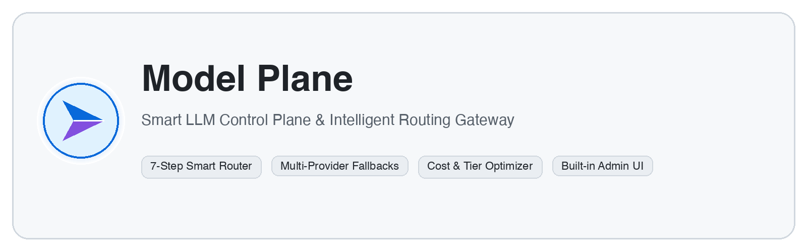

<!-- markdownlint-disable MD033 MD041 -->

<picture>
  <source media="(prefers-color-scheme: dark)" srcset="docs/brand/assets/model-plane-banner-dark.png">
  <source media="(prefers-color-scheme: light)" srcset="docs/brand/assets/model-plane-banner-light.png">
  
</picture>

<!-- markdownlint-enable MD033 MD041 -->

[](LICENSE)
[](https://www.python.org/)
[](https://fastapi.tiangolo.com)
[](https://carbondesignsystem.com/)
[](tests/)

> [!IMPORTANT]
> **Production-ready Model Control Plane:** Intelligent 7-step LLM routing, KV-cache switch-cost economics, multi-provider redundancy, and a Carbon Design System operator dashboard.

Model Plane is a lightweight, high-performance **model control plane and smart LLM gateway**. It acts as an intelligent proxy between your applications/agents and model providers (OpenAI, Anthropic, watsonx, Bedrock, Azure, Vertex, vLLM), dynamically picking the most cost-effective and capable model for every request.

```
Agent / Client (OpenAI or Anthropic SDK)
                  │
                  ▼
┌────────────────────────────────────────────────────────┐
│  Model Plane (Port 8081)                               │
│                                                        │
│  • OpenAI / Anthropic Drop-in Endpoints                │
│  • 7-Step Smart Routing & Intent Classification        │
│  • Cache Switch-Cost Economics & Policy Controls       │
│  • Full Admin Dashboard UI (`/admin`)                  │
└────────────────────────────────────────────────────────┘
      │         │          │          │          │
   OpenAI   Anthropic   watsonx    Bedrock    Azure / vLLM
```

---

## ⚡ Quick Start

### 1. Install & Run

```bash
# Clone the repository
git clone https://github.com/your-org/model-plane.git
cd model-plane

# Install Python & UI dependencies
pip install -e ".[dev]"
pnpm install

# Start both API and Admin UI dev server
pnpm start
```

- **API & Gateway**: `http://localhost:8081`
- **Admin Operator UI**: `http://localhost:5173/admin/` (or `http://localhost:8081/admin/` in production)

### 2. Configure Providers (via UI or `.env`)

You can set up credentials easily through the **Admin UI** or via `.env`:

1. **Via UI (Recommended)**: Open `http://localhost:5173/admin/settings` or `/admin/providers` and enter your provider API keys directly with real-time connectivity testing.
2. **Via `.env`**:
   ```bash
   cp .env.example .env
   # Add your key for OpenAI, Anthropic, watsonx, Bedrock, etc.
   # e.g., OPENAI_API_KEY=sk-...
   ```

---

## 🚀 Usage

Model Plane is fully compatible with OpenAI and Anthropic SDKs. Simply redirect your base URL:

### OpenAI SDK Drop-in

```python
from openai import OpenAI

client = OpenAI(
    base_url="http://localhost:8081/v1",
    api_key="optional-or-configured-key"
)

response = client.chat.completions.create(
    model="auto",  # or specify tier/deployment
    messages=[{"role": "user", "content": "Explain quantum computing simply"}]
)
print(response.choices[0].message.content)
```

### Anthropic SDK Drop-in

```python
from anthropic import Anthropic

client = Anthropic(
    base_url="http://localhost:8081",
    api_key="optional-or-configured-key"
)

response = client.messages.create(
    model="auto",
    max_tokens=1024,
    messages=[{"role": "user", "content": "Write a python fibonacci function"}]
)
print(response.content[0].text)
```

---

## ✨ Key Features

- **🎯 Smart 7-Step Routing**: Extracts request signals, classifies intent (simple / medium / complex / reasoning), blends scores, and picks the most cost-effective model.
- **🔌 Multi-Provider Support**: Out-of-the-box adapters for OpenAI, Anthropic, IBM watsonx, AWS Bedrock, Azure OpenAI, Google Vertex AI, Cohere, Mistral, and local vLLM.
- **🖥️ Operator Dashboard**: Manage model catalog CRUD, test provider connectivity, view live request traces, simulate routing decisions, and analyze cost breakdown.
- **💰 Cache & Switch-Cost Economics**: Account for KV cache retention and prompt switch cost before re-routing.
- **🛡️ Data Governance & Policies**: Enforce data sensitivity levels, PII detection, tenant allowances, and model fallbacks.

---

## 🛠️ CLI & Scripts

| Command | Description |
|---|---|
| `pnpm start` | Run API backend and Admin UI dev server concurrently |
| `pnpm run api` | Start FastAPI backend only (`:8081`) |
| `pnpm run ui` | Start Vite UI dev server only (`:5173`) |
| `pnpm run build` | Build production Admin UI bundle (`model_plane/ui/dist/`) |
| `pnpm test` | Run test suite with pytest and coverage |
| `pnpm run test:fast` | Run tests quickly without coverage |

---

## 🐳 Docker Deployment

```bash
# Build Docker image
docker build -t model-plane .

# Run container
docker run -p 8081:8081 \
  -e OPENAI_API_KEY="sk-..." \
  model-plane
```

Access the UI at `http://localhost:8081/admin/` and API at `http://localhost:8081/v1/`.

---

## 🤝 Contributing

We welcome community contributions! Please check out [CONTRIBUTING.md](CONTRIBUTING.md) to get started with setup, testing, and PR guidelines.

---

## 📄 License

This project is licensed under the [MIT License](LICENSE).
