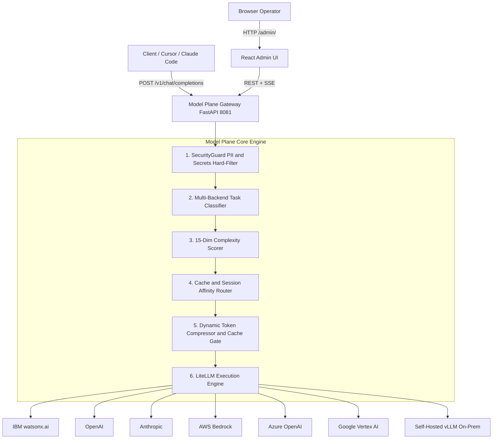
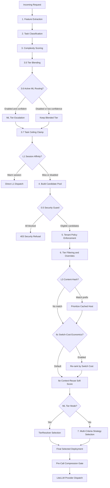
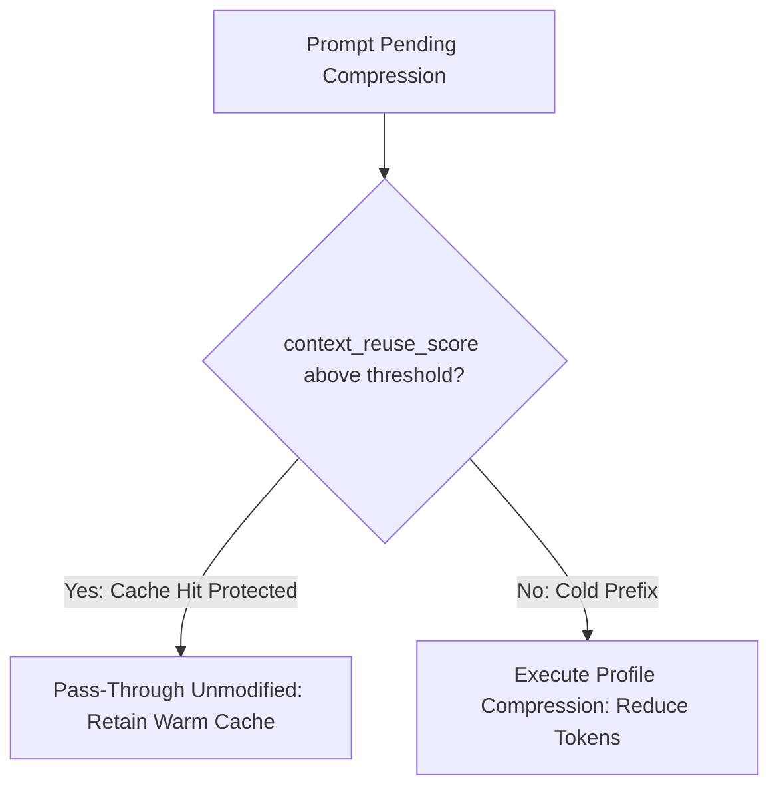
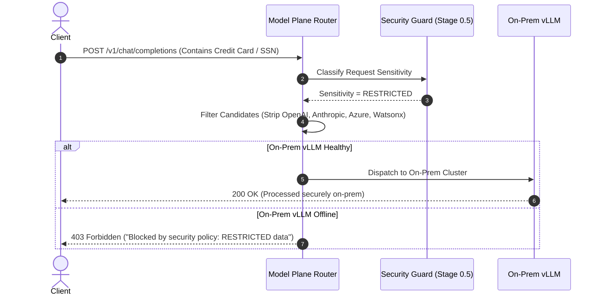
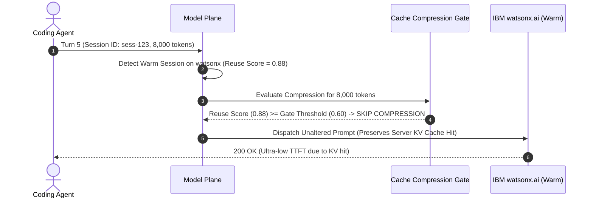

# Model Plane — Architecture Implementation & Engineering Guide

> **Version:** 0.2.0 · **Runtime:** Python 3.11 · **Framework:** FastAPI + LiteLLM  
> **Status:** Multi-Provider Expansion, Security Matrix, Cache Economics & Admin UI Complete · 358 tests passing · Production-Ready

---

## Table of Contents

1. [Executive Summary & High-Level System Topology](#1-executive-summary--high-level-system-topology)
2. [End-to-End Architectural Module Map](#2-end-to-end-architectural-module-map)
3. [The Complete Multi-Stage Routing Pipeline](#3-the-complete-multi-stage-routing-pipeline)
4. [Security & Data Governance Layer (Stage 0.5)](#4-security--data-governance-layer-stage-05)
5. [Cache Economics & Context Reuse Architecture (Stages L1, L3, 6c, 6e)](#5-cache-economics--context-reuse-architecture-stages-l1-l3-6c-6e)
6. [Dynamic Prompt Compression & Cache-Aware Gating](#6-dynamic-prompt-compression--cache-aware-gating)
7. [ML Routing, Classification Backends & Tier Resolution](#7-ml-routing-classification-backends--tier-resolution)
8. [Configuration Guide & Flag Impact Matrix](#8-configuration-guide--flag-impact-matrix)
9. [Detailed Scenario Execution Flows (Mermaid Diagrams)](#9-detailed-scenario-execution-flows-mermaid-diagrams)
10. [Persistence, Observability & Admin Management Layer](#10-persistence-observability--admin-management-layer)

---

## 1. Executive Summary & High-Level System Topology

Model Plane is a high-throughput, intelligent AI gateway and router sitting directly between client applications/agents and 9+ LLM backends (IBM watsonx.ai, OpenAI, Anthropic, AWS Bedrock, Azure OpenAI, Google Vertex AI, Cohere, Mistral, and self-hosted vLLM).



---

## 2. End-to-End Architectural Module Map

```text
model_plane/
├── app.py                      ← FastAPI factory, lifespan, CORS, and admin static mount
├── config.py                   ← Pydantic-settings configuration, env parsing & startup validators
├── db.py                       ← SQLite persistence (users, API keys, runtime overrides, cost buckets)
├── runtime_overrides.py        ← In-memory real-time overrides for zero-restart parameter tuning
├── provider_creds.py           ← Multi-provider dynamic credential resolution and health checking
├── logging_setup.py            ← Structured JSON logging (structlog)
│
├── adapters/                   ← PROTOCOL & EXECUTION LAYER
│   ├── chat_router.py          ← /v1/chat/completions endpoint, request validation, shadow routing
│   ├── messages_router.py      ← /v1/messages Anthropic-compatible protocol adapter
│   ├── admin_api_router.py     ← 30+ REST/SSE endpoints powering the React Admin UI
│   ├── settings_router.py      ← JWT authentication, user registration, and key management
│   ├── executor.py             ← LiteLLM acompletion wrapper, fallback chains, streaming
│   ├── auth.py                 ← API key and Bearer JWT validation dependencies
│   └── providers/              ← Provider-specific lifecycle adapters (watsonx, openai, bedrock, azure, etc.)
│
├── classifier/                 ← SIGNAL & TAXONOMY LAYER
│   ├── base.py                 ← ClassifierAdapter abstract protocol
│   ├── features.py             ← 14/15-dim signal extractor (regex, code tokens, formatting)
│   ├── classifier.py           ← Deterministic regex priority chain
│   ├── bert_classifier.py      ← ModernBERT zero-shot NLI intent classifier (opt-in)
│   ├── laya_classifier.py      ← Laya multi-label intent & tier classifier (opt-in)
│   ├── ml_task_classifier.py   ← Logistic regression model with portable JSON weights
│   ├── factory.py              ← Classifier instantiation factory (regex, mbert, laya, ml_task)
│   └── taxonomy.py             ← TaskType and ComplexityTier enumerations
│
├── scorer/                     ← COMPLEXITY QUANTIFICATION LAYER
│   └── scorer.py               ← 14/15-dim weighted sum → raw_score [0,1] → ComplexityTier
│
├── routing/                    ← INTELLIGENT DISPATCH & POLICY LAYER
│   ├── pipeline.py             ← Main orchestrator coordinating all pipeline stages
│   ├── security.py             ← SecurityGuard data-sensitivity matrix & regex PII detector (Stage 0.5)
│   ├── context_reuse.py        ← Soft context reuse & prefix caching scorer (Stage 6e)
│   ├── tier_resolver.py        ← Resolves candidate deployments matching target ML tiers
│   ├── strategy.py             ← Multi-criteria candidate scorer (cost, latency, trust, preference)
│   ├── context.py              ← RoutingContext & RoutingDecision dataclasses
│   └── similarity_router.py    ← Vector cosine similarity fast-path index
│
├── cache/                      ← SESSION & CACHE ECONOMICS
│   ├── session.py              ← In-memory / Redis session store tracking tokens and model affinity
│   └── switch_cost.py          ← Reprefill penalty vs output savings economics (Stage 6c)
│
├── compression/                ← TOKEN REDUCTION LAYER
│   └── processor.py            ← 4 compression profiles with cache-aware bypass gating
│
├── observability/              ← TELEMETRY & AUDIT
│   ├── metrics.py              ← Prometheus counters and latency histograms
│   ├── cost_accumulator.py    ← Real-time hourly cost aggregation buckets
│   └── request_buffer.py       ← 10,000-entry in-memory ring buffer for explorer inspection
│
└── ui/                         ← CARBON DESIGN SYSTEM OPERATOR UI
    ├── src/pages/              ← Dashboard, Catalog, Routing, Providers, Security, Compression, ML, Analytics
    └── src/api/client.ts       ← Strongly typed frontend API client
```

---

## 3. The Complete Multi-Stage Routing Pipeline

The pipeline processes requests through a deterministic, guard-railed sequence:



---

## 4. Security & Data Governance Layer (Stage 0.5)

### 4.1 Philosophy & Fail-Safe Rule
Security is implemented as a **hard eligibility filter** running prior to policy and candidate scoring. A restricted request will **never** be dispatched to an unapproved external provider, regardless of cost savings or performance advantages.

**Fail-Closed Default:** If an error occurs during classification, the request is automatically escalated to `CONFIDENTIAL`, stripping all `EXTERNAL_PUBLIC` endpoints.

### 4.2 Data Sensitivity & Provider Trust Matrix

| Data Sensitivity Level | Criteria / Heuristics Detected | Allowed Provider Trust Levels |
|---|---|---|
| **`PUBLIC`** | General coding, public documentation, QA, synthetic queries. | `EXTERNAL_PUBLIC`, `APPROVED_EXTERNAL`, `PRIVATE_CLOUD`, `ON_PREM` |
| **`INTERNAL`** | IP addresses, internal architecture keywords, project references. | `APPROVED_EXTERNAL`, `PRIVATE_CLOUD`, `ON_PREM` |
| **`CONFIDENTIAL`** | Passwords, database connection strings, JWTs, private keys. | `PRIVATE_CLOUD`, `ON_PREM` |
| **`RESTRICTED`** | SSN, Credit Cards, Government IDs, Healthcare PII, AWS secret keys. | `ON_PREM` only |

### 4.3 Provider Trust Classifications
- **`EXTERNAL_PUBLIC`**: OpenAI, Anthropic, Cohere, Mistral.
- **`APPROVED_EXTERNAL`**: Azure OpenAI, AWS Bedrock, Google Vertex AI (dedicated enterprise agreements).
- **`PRIVATE_CLOUD`**: IBM watsonx.ai on dedicated IBM Cloud VPC.
- **`ON_PREM`**: Self-hosted vLLM or local compute clusters.

---

## 5. Cache Economics & Context Reuse Architecture

Model Plane implements multi-level cache-aware routing to maximize KV-cache hits:

### 5.1 Level 1 — Session Affinity (`cache_session_affinity_enabled`)
- When a user session has accumulated $\ge \text{cache\_session\_affinity\_min\_tokens}$ (default 500), requests are locked to the warm deployment.
- Bypasses redundant scoring while respecting the security guard.

### 5.2 Level 3 — Content-Hash Routing (`cache_content_hash_routing_enabled`)
- For RAG systems, the client provides a `prefix_hash` representing retrieved context.
- Model Plane directs matching document hashes to the same deployment instance, up to `cache_content_hash_max_sticky` instances.

### 5.3 Stage 6c — Switch-Cost Economics (`cache_mode="switch_cost"`)
When switching from model $A$ to model $B$, the system models the economic tradeoff:
$$\Delta \text{Cost} = \text{Reprefill Cost}(B) - \text{Output Savings}(B \text{ vs } A)$$
If $\Delta \text{Cost} > 0$, candidate $B$ is penalized in sorting (capped at $\pm 0.30$).

### 5.4 Stage 6e — Context-Reuse Soft Score (`context_reuse_enabled`)
Deployments receive a bonus based on their cache capability tier:
- `NONE` (0.0): Blind external APIs.
- `RESPONSE` (0.25): Exact output caches.
- `PREFIX` (0.70): vLLM / Anthropic prompt caching.
- `KV_EVENTS` (1.0): Full distributed KV cache streaming.

---

## 6. Dynamic Prompt Compression & Cache-Aware Gating

To minimize API costs on long-context requests, the gateway provides 4 compression profiles:

1. **`tool_output_compaction`**: Truncates oversized raw JSON/tool outputs past 800 tokens.
2. **`code_context_reduction`**: Shortens repetitive code snippets down to 40 lines.
3. **`conversation_summary`**: Retains system prompt and the last $N$ turns while inserting a compact intermediate summary.
4. **`auto`**: Heuristically detects context composition and applies the best profile.

### The Cache-Aware Bypass Gate


---

## 7. ML Routing, Classification Backends & Tier Resolution

### 7.1 Classifier Backends
- **`regex`** *(default)*: Zero-latency deterministic regex priority rules.
- **`mbert`**: ModernBERT zero-shot NLI classifier for semantic intent identification.
- **`laya`**: CPU-optimized multi-label intent and tier model.
- **`ml_task`**: Logistic regression classifier using portable JSON weights.

### 7.2 Tier Blending
Prevents under-routing by resolving the final complexity tier as:
$$\text{Blended Tier} = \max(\text{Scorer Tier}, \text{Classifier Tier})$$

---

## 8. Configuration Guide & Flag Impact Matrix

| Parameter / Env Variable | Default | Internal Outcome When Enabled | Internal Outcome When Disabled |
|---|---|---|---|
| `MODEL_PLANE_SECURITY_ROUTING_ENABLED` | `true` | Executes Stage 0.5. Classifies PII/secrets; removes untrusted providers. Refuses request if no safe provider exists. | Bypasses sensitivity classification. All healthy providers remain candidates regardless of data sensitivity. |
| `MODEL_PLANE_CACHE_SESSION_AFFINITY_ENABLED` | `true` | Locks repeat sessions ($\ge 500$ tokens) to the existing warm deployment. | Evaluates every request turn through the full scoring pipeline. |
| `MODEL_PLANE_CACHE_CONTENT_HASH_ROUTING_ENABLED` | `true` | Prioritizes candidate deployments with active KV caches for matching `prefix_hash`. | Disregards RAG document prefix locality during deployment sorting. |
| `MODEL_PLANE_CACHE_MODE` | `soft_preference` | If set to `switch_cost`, calculates explicit USD reprefill penalties and re-ranks candidates accordingly. | Uses standard heuristic score adjustments for session continuity. |
| `MODEL_PLANE_COMPRESSION_ENABLED` | `true` | Truncates tool outputs and summarizes message history when input exceeds token thresholds. | Forwards all messages byte-for-byte to the downstream provider. |
| `MODEL_PLANE_CONTEXT_REUSE_ENABLED` | `true` | Applies Stage 6e soft re-ranking based on provider cache capability (`none`, `prefix`, `kv_events`). | Leaves candidate ranking unadjusted by cache capability. |
| `MODEL_PLANE_ML_ROUTING_ENABLED` | `false` | Stage 3.6 ML model predicts complexity tier and escalates when confidence $\ge$ threshold. | Tier decisions are determined strictly by deterministic scoring and regex classification. |
| `MODEL_PLANE_CLASSIFIER_MODEL` | `regex` | Selects intent classification engine (`regex`, `mbert`, `laya`, `ml_task`). | Falls back to pure regex matching if an invalid or uninstalled model is specified. |

---

## 9. Detailed Scenario Execution Flows

### Scenario A: Restricted PII Request Flow


### Scenario B: Multi-Turn Warm Session with Compression Bypass



---

## 10. Persistence, Observability & Admin Management Layer

- **SQLite Database (`config/model_plane.db`)**:
  - `users`: Managed operator accounts with salted SHA-256 / Argon2 password verification.
  - `api_keys`: Gateway authentication keys with prefix masking and ownership isolation.
  - `kv`: Dynamic runtime overrides for smart routing, provider keys, and compression settings.
  - `cost_buckets`: Aggregated input/output token counts and USD costs across provider/tier/task dimensions.
- **In-Memory Ring Buffer (`RequestRingBuffer`)**: Retains the last 10,000 routing decisions with full feature traces, sensitivity labels, and score breakdowns for interactive UI debugging.
- **Prometheus Telemetry (`/metrics`)**: Exposes request rates, token volumes, compression ratios, and end-to-end latency histograms.
- **Admin UI**: React 18 single-page app styled with Carbon Design System components, supporting real-time configuration tuning, pipeline simulation, and provider health management.
